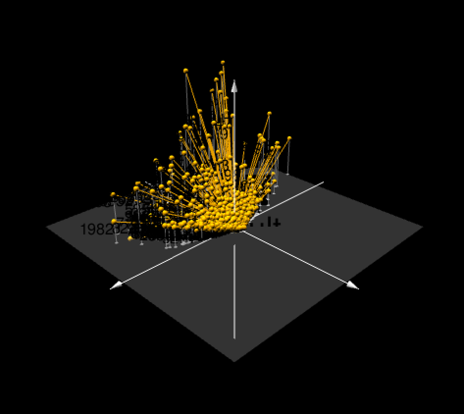
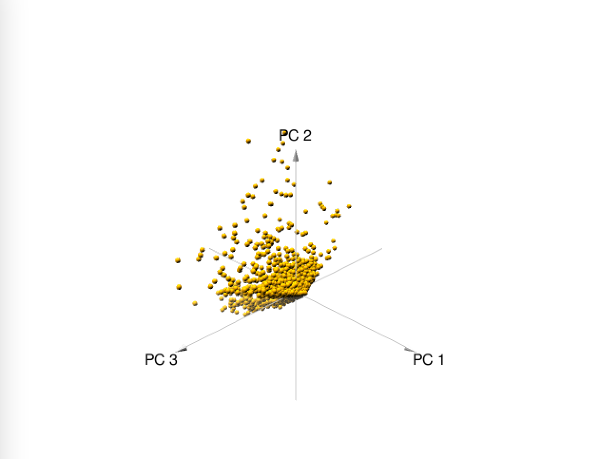

# Vessel Activity-Global Fishing Watch

### <mark style="color:blue;">**Overview**</mark>

This dataset contains the [Global Fishing
Watch](https://globalfishingwatch.org/datasets-and-code/) AIS-based
fishing effort and vessel presence datasets. Data is based on fishing
detections of \>114,000 unique AIS devices on fishing vessels, of which
\~70,000 are active each year. Fishing vessels are identified via a
neural network classifier, vessel registry databases, and manual review
by GFW and regional experts. Data are binned into grid cells 0.01 (or
0.1) degrees on a side and measured in units of hours. The time is
calculated by assigning an amount of time to each AIS detection (which
is the time to the previous position) and then summing all positions in
each grid cell.

[](https://globalfishingwatch.org/map-and-data/)

#### *Data are available in two formats:*

1.  Fishing effort by flag state and gear type at 100th degree
    resolution (i.e. too large to upload)
2.  Fishing effort by MMSI at 10th degree resolution (i.e. too large to
    upload)

Each version of the fishing effort dataset is accompanied by a table of
vessel information (e.g. gear type, flag state, dimensions, etc. listed
in the metadata folder).

*Note: When attempting to download multiple files, you will receive an
email containing download links after the data has been packaged. For
large requests, it may take up to 24 hours to receive this email.*

#### *Versions*

The fishing effort data is updated periodically to include more recent
data and as improvements are made to our models and input data. Data
from different major/minor versions should not be combined, as each
version uses a different set of inputs.

*Current version*

2.0: Fishing effort data for 2012-2020 using the latest AIS algorithms,
*neural network models*, and *vessel registry database*.

### <mark style="color:blue;">AIS Data</mark>

This MMSI number is usually unique to a single vessel and typically
doesn't change unless the vessel is red-flagged. Most of the naval
vessels investigated by Global Fishing Watch (GFW) did appear to use a
particular MMSI number consistently even if the vessel only broadcast
AIS occasionally. The MMSI numbers used by different naval vessels are
listed on sites like Marine Traffic or even Wikipedia. But how can we
really be sure that an MMSI number corresponds to a particular naval
vessel? Naval vessels are frequently photographed, and it's possible to
get a sequence of port visits based on photos uploaded to sites like
*warshipcam.com*. *This documented series of port visits can then be
compared to the AIS track to confirm that an MMSI corresponds to a
particular vessel.* (Clavelle, Tyler Global Fishing Watch)

### <mark style="color:blue;">Data Wrangling & Exploration</mark>

In a snapshot, some of the steps for data exploration in this analysis
include :

-   Import data (i.e. Data imported here was downloaded from the GFW
    website/ Although in a separate R script in `model_results` folder I
    used `BigQuery`). The dataset used below is `fishing-vessels-v2.csv`
    saved as `vessels.Rda`
-   Clean data (I mainly worked with `vessels.Rda`. The other files were
    too large and exceeded `Github` 2 GB limit.)
-   Format data properly
-   Create new variables
-   Get an overview of the complete data (i.e. especially missing data)
-   Split data into training and test sets using stratified sampling
    (i.e. strata is geartype here)
-   Discover and visualize the data to gain insights

<!-- -->

``` {r setup}
knitr::opts_chunk$set(echo = TRUE, message = FALSE, warning = FALSE)
```

#### **Load Packages**

We will use several R packages to work with the data. The tidyverse
package contains several helpful packages for data manipulation (dplyr,
tidyr, readr) and plotting (ggplot2), `lubridate()` which is great for
working with dates. The `tidymodels()` package is key to this analysis
for setting up all the models for machine learning.

Some of the Models used include :

PCA Lasso and Elastic-Net Regularized Generalized Linear Decision Tree
Random Forest Boosted Tree KNN Neural Network

### <mark style="color:blue;">Loading packages</mark>

```{r packages}
knitr::opts_chunk$set(echo = TRUE, message = FALSE, warning = FALSE)


# ### Geo Packages
# library(raster) # for working with rasters needs to run before tidyverse or select() wont work
# library(maps) # additional helpful mapping packages
# library(maptools)
# library(tmap)
# library(rgeos)
# library(gstat)
# library(sf) # for vector data 
# #install.packages("rnaturalearth")
# library(rnaturalearth)
# library(sp)

### Data Cleaning & wrangling
library(tidyverse) # for general data wrangling and plotting
library(purrr)
library(lubridate) # for working with dates
library(here) # for paths
library(janitor) # for cleaning var names 
library(formatR) #used for chunk tidy code formatting
library(knitr)

### ML packages
library(tidymodels)
library(glmnet) # Lasso and Elastic-Net Regularized Generalized Linear Models 
library(vip)
library(randomForest)
library(ranger) #for random forest
library(xgboost)
library(kableExtra)
library(readr)
library(corrr)
library(corrplot)
library(klaR)
library(tune)

###Visualization
library(corrplot) # to create a correlation matrix
library(rpart.plot) # for trees to plot an rpart model
# library(fishualize) #
# library(fishmethods)
library(GGally)
library(visdat)
library(skimr)
library(kableExtra)

### Query
# library(bigrquery) #Interface to Google's 'BigQuery' 'API'
```

### <mark style="color:blue;">Import Data</mark>

Daily fishing effort data are available for download in the following
two formats:

-   Daily Fishing Effort and Vessel Presence at **100th** Degree
    Resolution by Flag State and GearType, 2012-2020
-   Daily Fishing Effort and at **10th** Degree Resolution by MMSI,
    2012-2020

Upon downloading each dataset, users will receive a `.zip` file. When
using GFW website you could select how many files you want to download.
Some of the files downloaded for this analysis include data readme.txt
files (i.e metadata folder), daily_csvs folder (i.e MMSI, fleet), and
daily fishing effort and vessel presence`fishing-vessels-v2.csv` saved
as\
`vessels.Rda`.This data can be used in conjunction with the "Daily
Fishing Effort and at 10th Degree Resolution by MMSI" data to explore
vessel and fleet characteristics and provide details (gear type, flag
state, etc.) for the MMSI being analyzed.

The daily csvs are named according to the *YYYY-MM-DD.csv* format. The
files generally increase in size over time due to the higher number of
satellites receiving AIS data.

#### **Shapefiles**

Shapefiles of land and Exclusive Economic Zone (EEZ) boundaries are
useful for providing context to maps of fishing efforts (too large to
upload). For this analysis, we'll use a land shapefile from the maps R
package and an **EEZ shapefile** from **MarineRegions.org**. We'll also
load/convert both of these **shapefiles** to sf objects. The `sf` R
package is a great package for working with vector data stored in
dataframes, providing numerous functions for performing spatial
operations.

**World polygons from the maps package**

``` {r world}
# load("world.Rda")
```

#### **Load EEZ polygons**

``` {r eezs}
# load("eezs.Rda")
```

### <mark style="color:blue;">Loading the data</mark>

``` {r load data}
# load vessels yearly data
load("vessels.Rda")
# head(vessels)
```

### <mark style="color:blue;">Geartypes:</mark>

The current version of the GFW vessel classification neural net
classifies fishing vessels into sixteen categories.


Longline fishermen use lines that can extend for up to 50 miles, with
thousands of baited hooks branching off from the main line.
Unfortunately, the baited hooks attract a vast array of species that are
not intentionally targeted, including diving birds, turtles, etc. If an
animal becomes hooked, it is often seriously injured or dead by the time
the gear is retrieved. Using more selective gear instead of longlines is
proven to reduce bycatch and improve fishing efficiency. (oceana.org)

Some classes of the outcome variable chosen for this analysis are
described below :

-   `fishing`: a combination of vessels of unknown fishing gear
-   `drifting_longlines`: drifting longlines
-   `seiners`: vessels using seine nets, including potential purse seine
    vessels targeting tuna and other species, as well as danish and
    other seines
-   `purse_seines`: purse seines, both pelagic and demersal
-   `tuna_purse_seines`: large purse seines primarily fishing for tuna.
-   `other_purse_seines`: purse seiners fishing for mackerel, anchovies,
    etc, often smaller and operating nearer the coast than tuna purse
    seines.
-   `other_seines`: danish seines and other seiners not using purse
    seines.
-   `trawlers`: trawlers, all types
-   `pole_and_line`: vessel from which people fish with pole and line.
-   `trollers`: vessel that tows multiple fishing lines.
-   `fixed_gear`: a category that includes potential set longlines, set
    gillnets, and pots and traps

### Vessel Gear {.tabset .tabset-fade .tabset-pills}

### <mark style="color:blue;">Exploratory Data Analysis</mark>

``` {r eda}
#To get a first impression of the data we take a look at the top 4 rows:
# install.packages("gt")
library(gt)

#vessels data quick exploration
vessels %>% 
  slice_head(n = 4) %>% 
  gt() # print output using gt


# Creating and storing a table of yearly vessels geartype
vessels_gear <- vessels %>% 
group_by(vessel_class_gfw) %>% 
  summarize(sum_class= n()) %>% 
  arrange(desc(sum_class))

# Proportion of each vessel's geartype 
vessels %>% 
  count(vessel_class_gfw) %>% 
mutate(prop = n/sum(n)) %>%
  arrange(-(round(prop,2))) %>% 
  kable(caption = "Fishing Gear Class") %>% 
  column_spec( 1:3, width = "10em") %>% 
  kable_styling(bootstrap_options = "striped")

# howw many geartypes in the dataset
vessels %>% 
  ggplot(aes(x=reorder(vessel_class_gfw, vessel_class_gfw, function(x) length(x)))) +
  geom_bar(aes(fill=vessel_class_gfw,stat="identity"))+
  theme_bw()+
  labs(x="") +
  theme(axis.ticks.y = element_line(size =1),
panel.grid = element_blank(), legend.key = NULL)+
  coord_flip()  
```

-   There are sixteen levels of the outcome, or primary classes of
    geartype, in the data. The classes with the smallest numbers of
    geartype are seiners,trollers, pure seine and other seines.
-   We'll handle the smaller classes by simply filtering them out.
    Filter the entire data set to contain only fleets whose geartype is
    set_longlines, set_gillnets, squid_jigger, tuna_purse_seines,
    fixed_gear, pole_and_line.

``` {r vessels df}
# Creating a vessels df and filtering for the geartype of choice

vessels_df <- vessels %>% 
filter(vessel_class_gfw %in% c("set_longlines", "set_gillnets", "tuna_purse_seines",    "fishing",          
"other_purse_seines","  drifting_longlines"))%>% 
  mutate(flag = factor(flag_gfw),
        vessel_class_gfw = factor(vessel_class_gfw)) 

# Creating a subset of the vessel_df
vessels_sub <- sample_n(vessels_df,10000) %>% 
  imputeTS::na.replace(0) 

# Let's look at the proportion of geartype within our subset
vessels_sub %>% 
  count(vessel_class_gfw) %>% 
  mutate(prop = n/sum(n)) %>%
  arrange(-(round(prop,2))) %>% 
  kable(caption = "Fishing Gear Class") %>% 
  column_spec( 1:3, width = "10em") %>% 
  kable_styling(bootstrap_options = "striped")

# Na's
# is.na(vessels_sub) %>% colSums()
vis_dat(vessels_sub)


# Visualization the classes of our our outcome variable
vessels_sub %>% 
  ggplot(aes(x=reorder(vessel_class_gfw, vessel_class_gfw, function(x) length(x)))) +
  geom_bar(aes(fill=vessel_class_gfw,stat="identity"))+
  theme_bw()+
  labs(x="") +
  theme(axis.ticks.y = element_line(size =1),
  panel.grid = element_blank(), legend.key = NULL)+
  coord_flip()  
```

### <mark style="color:blue;">Machine Learning Models</mark>

#### Principal components analysis (PCA)

Principal components analysis is an ordination method allowing us to
glean as much about our multivariate data as possible in a simplified
number of dimensions. Here, we'll use our dataset of fishing vessels to
explore variable relationships and clustering by geartype in a PCA
biplot. For this example with PCA, we will only use numeric predictors
(i.e.mmsi,vessel_class_inferred_score,length_m\_inferred,engine_power_kw)\*.

We use the R built-in function `prcomp()` to calculate the principal
components of the dataset. It's important to specify `scale = TRUE` so
that each of the variables in the dataset are scaled to have a mean of 0
and a standard deviation of 1 before calculating the principal
components.

Also note that eigenvectors in R point in the *negative direction* by
default, so we'll multiply by *-1* to reverse the signs.

``` {r pca, results = "hide"}
# install.packages("imputeTS")

library(imputeTS) # for na.replace
#calculate principal components
vessels_pca <- vessels_sub %>%
  select_if(is.numeric) %>% 
  imputeTS::na.replace(0) %>% 
  scale() %>% 
  prcomp()


#reverse the signs
vessels_pca$rotation <- -1*vessels_pca$rotation

#display principal components
vessels_pca$rotation

#reverse the signs of the scores
vessels_pca$x <- -1*vessels_pca$x

#display the first six scores
# head(vessels_pca$x)


```


```{r pcs plots}
library(pca3d) # 2d & 3d pca plots
library(viridis) #color palette
library(grDevices)
# Variance explained by each PC
screeplot(vessels_pca, type = "lines")
screeplot(vessels_pca, type = "barplot")
pca2d(
   vessels_pca,
  components = 1:2,
  col = NULL,
  title = NULL,
  new = FALSE,
  axes.color = "black",
  bg = "white",
  radius = 1,
  shape = 18,
  palette = palette(hcl.colors(3, "viridis")) )

pca_3d <- pca3d(
  vessels_pca,
  components = 1:3)

## a bit more fancy:
  ## black background, white axes,
  ## centroids
pca2_3d <- pca3d(
  vessels_pca,
    fancy= TRUE, bg= "black", 
    axes.color= "white", new= TRUE) 
```

The PCA analysis indicates that PC1 & PC2 represent a good amount of the
data compared to the rest.





#### **Data splitting**

``` {r data splitting}
set.seed(3435)

# Split the dataset into train and test

vessels_split <- initial_split(vessels_sub, prop = 0.8, strata = vessel_class_gfw)
vessels_train <- training(vessels_split)
vessels_test <- testing(vessels_split)
# dim(vessels_train)
```

In order to have a good training set, we set up a prop equal to 80% and
our training set has 29 variables with 7998 obs.

#### **Training set Visualisation**

a.  Corrplot

``` {r vessel train corrplot}
vessels_train %>% 
  select_if(is.numeric ) %>% 
  dplyr::select(- vessel_class_inferred_score) %>% 
  dplyr::select(- starts_with("fishing")) %>% 
  cor(use = "complete.obs") %>% 
  corrplot(type = "lower", diag = FALSE)
```

From the corrplot, we can see that tonnage_gt\_ registry and
engine_power_kw_gfw are positively correlated but length_mregitery is
negatively correlated with engine power.

b.  Barplot

``` {r train plot}
vessels_train %>% 
  ggplot(aes(x = vessel_class_gfw)) +
  geom_bar(aes(fill=vessel_class_gfw))
```

From the barplot of the chosen predictors : "set_longlines",
"set_gillnets", "tuna_purse_seines", "fishing",\
"other_purse_seines"," drifting_longlines". We notice that `fishng`
class has more observations than the others.

#### **Cross-Validation folds**

For the cross-validation, I'm using v = 3 folds and stratifying the
outcome variable for geartype `vessel_class_gfw`.

```{r vfolds}
set.seed(3435)
vessels_folds <- vfold_cv(data = vessels_train, v = 3, strata = vessel_class_gfw)
```

Using a subset of the data and given that the training set only has 29
vars and many observations. we chose to use lower **v-folds** to avoid
having an imbalance in a given class where an outcome variable may
either be present or not.

### <mark style="color:blue;">Vessel recipe</mark>

In this section, we chose our model recipe : predictors for the outcome
variable. Note that I used `na.replace(0)` for the fishing hours yearly
variables due to to the large numbers of missing data.

``` {r recipe}
vessels_recipe <- recipe(vessel_class_gfw ~ length_m_gfw+ mmsi+ tonnage_gt_gfw +
  fishing_hours_2012 + fishing_hours_2015 + fishing_hours_2018 + fishing_hours_2013 +fishing_hours_2016 + fishing_hours_2019 + fishing_hours_2014 + fishing_hours_2017 + fishing_hours_2020, data = vessels_train) %>% 
   step_rollimpute(all_predictors()) %>% 
  step_naomit(everything(), skip = TRUE) %>% 
  step_dummy(all_nominal_predictors()) %>% 
  step_normalize(all_predictors()) %>% 
  step_novel(all_nominal(), -all_outcomes()) %>% 
  step_zv(all_numeric(), -all_outcomes()) %>% 
  step_corr(all_predictors(), threshold = 0.7, method = "spearman")


# glimpse(prepped_data)
```

#### **Elastic Tuning Net**

We'll be fitting and tuning an elastic net, tuning penalty and mixture
using `multinom_reg` with the glmnet `engine`for classification. We set
up a model and workflow, create a regular grid for penalty and mixture
with 10 levels each; mixture should range from 0 to 1. The penalty range
used is from -5 to 5 (it's log-scaled).

``` {r}
# Elastic Net Model
elastic_net_spec <- multinom_reg(penalty = tune(), 
                                 mixture = tune()) %>% 
  set_mode("classification") %>% 
  set_engine("glmnet")

en_workflow <- workflow() %>% 
  add_recipe(vessels_recipe) %>% 
  add_model(elastic_net_spec)

en_grid <- grid_regular(penalty(range = c(-5, 5)), 
                        mixture(range = c(0, 1)), levels = 10)
```

Using `library(tictoc)` to print the system running time for my model

``` {r}
library(tictoc)
tic()
tune_res_1 <- tune_grid(
  en_workflow,
  resamples = vessels_folds, 
  grid = en_grid
)

# save(tune_res_1, file ="tune_res.Rda")
# load("tune_res.Rda")
ggplot2::autoplot(tune_res_1)
toc()
```

We're fitting a grid of 100 combinations of values for the
hyperparameters penalty and mixture, or 100 models, and we're fitting
each of these once per fold, for a total of 200 models.

``` r
tune_res_1 <- tune_grid(
  en_workflow,
  resamples = vessels_folds, 
  grid = en_grid
)

autoplot(tune_res_1)
```

Smaller values of penalty, or "amount of regularization," and smaller
values of mixture, or "proportion of lasso penalty," tend to result in
higher ROC-AUC and accuracy values.

#### **Model Prediction, fitting & Visualization**

``` {r}
best_model <- select_best(tune_res_1, metric = "roc_auc")

en_final <- finalize_workflow(en_workflow, best_model)

en_final_fit <- fit(en_final, data = vessels_train)

predicted_data <- augment(en_final_fit, new_data = vessels_test) %>% 
  dplyr::select(vessel_class_gfw, starts_with(".pred")) 


predicted_data %>% 
  conf_mat(truth =vessel_class_gfw, estimate = .pred_class) %>%
  autoplot(type = "heatmap")
```

In the heat map, the correct classifications are always on the diagonal
and misclassifications on the off-diagonals. The model correctly
identified fishing geartype, for example. From the heat map, we can see
that the model doesn't seem to be able to distinguish other_purse_seines
well at all; it misclassifies other geartypes as fishing frequently.

``` {r}
predicted_data %>% roc_auc(vessel_class_gfw, .pred_fishing:.pred_tuna_purse_seines)
```

roc_auc in this model is around 72%.

#### Decision Trees

One of our favorite machine learning algorithms is **decision trees**. A
single decision tree generally doesn't have great "out of the box" model
performance, and even with considerable model tuning, they are unlikely
to perform as well as other approaches. Decision trees are
non-parametric, meaning they do not make any assumptions about the
underlying data-generating process.

At their core, decision trees work by splitting the features into a
series of yes/no decisions. These splits divide the feature space into a
series of non-overlapping regions, where the cases are similar in each
region. To understand how a given prediction is made, one simply
"follows" the splits of the tree (a branch) to the terminal node (the
final prediction). This splitting continues until a specified criterion
is met.

#### **Decision tree hyperparamters**

Decision trees have three hyperparameters as shown below. These are
standard hyperparameters and are implemented in {rpart}, the engine used
to fit decision tree models in the previous section. Alternative
implementations may have slightly different hyperparameters (see the
documentation for `parsnip::decision_tree()` details on other engines).

First,I set up a decision tree model and workflow. Tune the
`cost_complexity` hyperparameter using 10 levels, `range = c(-3, -1)`
and specify that the metric we want to optimize is `roc_auc`. Lastly,
print an `autoplot()` of the results.

``` {r}
tree_spec <- decision_tree() %>%
  set_engine("rpart")

class_tree_spec <- tree_spec %>%
  set_mode("classification")


class_tree_wf <- workflow() %>%
  add_recipe(vessels_recipe) %>%  
  add_model(class_tree_spec %>% set_args(cost_complexity = tune())) 

param_grid_tr <- grid_regular(cost_complexity(range = c(-3, -1)), levels = 10)


tune_res_tr <- tune_grid(
  class_tree_wf, 
  resamples = vessels_folds, 
  grid = param_grid_tr, 
  metrics = metric_set(roc_auc)
)


autoplot(tune_res_tr)
```

A single decision tree performs better with larger complexity penalty(
peak at mid level complexity)

``` {r tree metrics}
tree_metrics <- collect_metrics(tune_res_tr) %>% 
arrange(desc((mean)))

best_complexity <- select_best(tune_res_tr )
```

#### **Decision Tree Visualization**

Using `rpart.plot`, I fit and visualize my best-performing pruned
decision tree with the *training* set.

``` {r}

class_tree_final <- finalize_workflow(class_tree_wf, best_complexity)

class_tree_final_fit <- fit(class_tree_final, data = vessels_train)

class_tree_final_fit %>%
  extract_fit_engine() %>%
  rpart.plot()
```

#### **Random forest**

In this section, I set up a random forest model with `rand_forest()`, a
workflow using the `ranger` engine and set `importance = "impurity"`.
Then, once again I will tune `mtry`, `trees`, and `min_n`.

#### **Random forest tree hyperparameters**

I start by creating a regular grid with 8 levels each. For each
hyperparameter (i.e. this model has 3 tuning parameters I specify the
following ranges :

mtry: \# Randomly Selected Predictors reduce variance because `mtry`
allows to choose vars randomly. Depends on the number of columns. mtry =
P/3 or sqrt P Note that `mtry` should not be smaller than 1 or larger
than 8.

trees: \# Trees (type: integer, default: 500L)

min_n: (stopping criterion) defines the minimal node size (node 1 and
has 10 obs). min_n depends on the mode. For regression, a value of 5 is
the default. For classification, a value of 10 is used.

``` {r random forest}
class_rf_model = rand_forest(mtry = tune(), trees = tune(), min_n = tune()) %>% 
  set_engine("ranger", importance = "impurity") %>% 
  set_mode("classification") 


class_rf_wflw = workflow() %>% 
  add_recipe(vessels_recipe) %>% 
  add_model(class_rf_model) 


library(tictoc)
tic()

rf_grid <- grid_regular(
  mtry(range = c(1, 8)), #set mtry to 1-8
  trees(range = c(100,200)), #set trees 100 to 200
  min_n(range = c(2, 10)), # set min_n between 2 and 20
  levels = 8) #what's a good level?

rf_tune <- tune_grid( 
  class_rf_wflw,
  resamples = vessels_folds, 
  grid = rf_grid, 
  metrics = metric_set(roc_auc) 
  )
toc()


autoplot(rf_tune)

saveRDS(rf_tune,file = "rf_tune.RDS")
rf_tune_results <- readRDS("rf_tune.RDS")

rf_tree_metrics <- collect_metrics(rf_tune) %>% 
arrange(desc((mean)))
rf_tree_metrics
best_complexity_rf <- select_best(rf_tune)

```

#### **Random forest Predictions**

Using `vip()`, with your best-performing random forest model fit on the
*training* set.

Which variables were most useful? Which were least useful? Are these
results what you expected, or not?

From the above graph, special attack is the most important variable.
Attack, speed,defense, hp,and special are equally as important.

``` {r vip}
rf_final <- finalize_workflow(class_rf_wflw, select_best(rf_tune)) 

rf_fit <- fit(rf_final, vessels_train)  

 vip_rf <- rf_fit %>% 
  extract_fit_engine() %>%
  vip()
 
 vip_rf
```

#### Boosted tree

Here, I set up a boosted tree model and workflow using the `xgboost`
engine. Then, I use `tune()` to set a boosted model trees. The grid used
below contains 10 levels; where `trees` range from 10 to 2000. Lastly, I
specify `roc_auc` in my model metrics and print an `autoplot()` to view
the results.

```{r boosted tree}
boost_model = boost_tree(trees = tune()) %>% #set up boosted tree model
  set_engine("xgboost") %>% # xgboost engine calculates lambda #high lambda is good 
  set_mode("classification") 


boost_wflw = workflow() %>%
  add_recipe(vessels_recipe) %>% 
  add_model(boost_model) 

boost_grid <- grid_regular(
  trees(range = c(10,2000)), 
  levels = 10) 

boost_tune_res <- tune_grid( 
  boost_wflw, 
  resamples = vessels_folds, 
  grid = boost_grid, 
  metrics = metric_set(roc_auc) 
  )

# saveRDS(boost_tune_res,file = "boost_tune.RDS")
# boost_results <- readRDS("boost_tune.RDS")
# autoplot(boost_results)

autoplot(boost_tune_res) 
```

ROC AUC peaks 231 then slowly declines again.

``` {r boosted tree metrics}
boost_metrics <- collect_metrics(boost_tune_res) %>% 
arrange(desc((mean)))

best_complexity_boost <- select_best(boost_tune_res)
```

The `roc_auc` of the best-performing boosted tree model on the folds

#### **Decion Tree, Random Forest, & Boosting model predictions**

``` {r all tree metrics}
models = full_join(tree_metrics, rf_tree_metrics)
joined_models = full_join(models, boost_metrics)
joined_models 
```

The best model is the random forest model, with an AUC ROC of 0.628.

#### **Best-performing model on the testing set**

``` {r fitting}
rf_test_fit = augment(rf_fit, new_data = vessels_test) 
roc_auc(rf_test_fit, truth = vessel_class_gfw, .pred_fishing:.pred_tuna_purse_seines) 
```

AUC value of the best-performing model on the testing set.

``` {r autoplot}
autoplot(roc_curve(rf_test_fit, truth = vessel_class_gfw, .pred_fishing:.pred_tuna_purse_seines)) 

conf_mat(rf_test_fit, truth = vessel_class_gfw, estimate = .pred_class) %>% 
  autoplot(type = "heatmap") + 
  theme(axis.text.x = element_text(angle = 90, hjust=1)) 
```

#### **K-nearest neighbor**

``` {r knn}
library(kknn)
knn_spec <- 
  nearest_neighbor(neighbors = 4) %>% # we can adjust the number of neighbors 
  set_engine("kknn") %>% 
  set_mode("classification") 

knn_wflow <-
 workflow() %>%
 add_recipe(vessels_recipe) %>% 
 add_model(knn_spec)

knn_res <- 
  knn_wflow %>% 
  fit_resamples(
    resamples = vessels_folds, 
    metrics = metric_set(
      recall, precision, f_meas, 
      accuracy, kap,
      roc_auc, sens, spec),
    control = control_resamples(save_pred = TRUE)
    ) 

knn_res %>% collect_metrics(summarize = TRUE)
# knn_results <- saveRDS(boost_tune_res,file = "boost_tune.rds")
# knn_results <- readRDS("boost_results.rds")
```

The `roc_auc` of the best-performing knn here is 0.40

#### **Neural network**

```{r neural network}
#  # ?keras::install_keras()
# # install_keras(Tensorflow = "1.13.1",
# # restart_session = FALSE)
# library(keras)
# library(tensorflow)
# 
# nnet_spec <-
#   mlp() %>%
#   set_mode("classification") %>% 
#   set_engine("keras", verbose = 0) 
# 
# nnet_wflow <-
#  workflow() %>%
#  add_recipe(vessels_recipe) %>% 
#  add_model(nnet_spec)
# 
# nnet_res <- 
#   nnet_wflow %>% 
#   fit_resamples(
#     resamples = vessels_folds, 
#     metrics = metric_set(
#       recall, precision, f_meas, 
#       accuracy, kap,
#       roc_auc, sens, spec),
#     control = control_resamples(save_pred = TRUE)
#     ) 
```

### Conclusion

The best performing models out of those tested are elastic tuning and
neural network. The model would do much better if coupled with the
geographic data for longitude and latitude for better estimates of
vessel geartype used. This type of modeling can help in the future with
marine conservation and help improve traditional fishing methods for
more sustainable ones.

### References

"Copyright [2022], Global Fishing Watch, Inc.,
www.globalfishingwatch.org."

*"Global Fishing Watch has made every attempt to ensure the
completeness, accuracy, and reliability of the information provided on
this Site. However, due to the nature and inherent limitations in source
materials for information provided, Global Fishing Watch qualifies all
designations of vessel fishing activity, including synonyms of the term
"fishing activity," such as "fishing" or "fishing effort," as
"apparent," rather than certain. And accordingly, the information is
provided "as is" without warranty of any kind."*

Clavelle, Tyler. "Working with Our Downloadable Public Data in R."
Global Fishing Watch, 29 May 2019,
<https://globalfishingwatch.org/data/working-with-our-downloadable-public-data-in-r/>.

Flanders Marine Institute (2019). Maritime Boundaries Geodatabase:
Maritime Boundaries and Exclusive Economic Zones (200NM), version 11.
Available online at <https://www.marineregions.org/>.
<https://doi.org/10.14284/386>

"Harmful Gear: Trawls, Longlines, & Gillnets." Oceana USA,
<https://usa.oceana.org/harmful-gear-trawls-longlines-gillnets/>.
